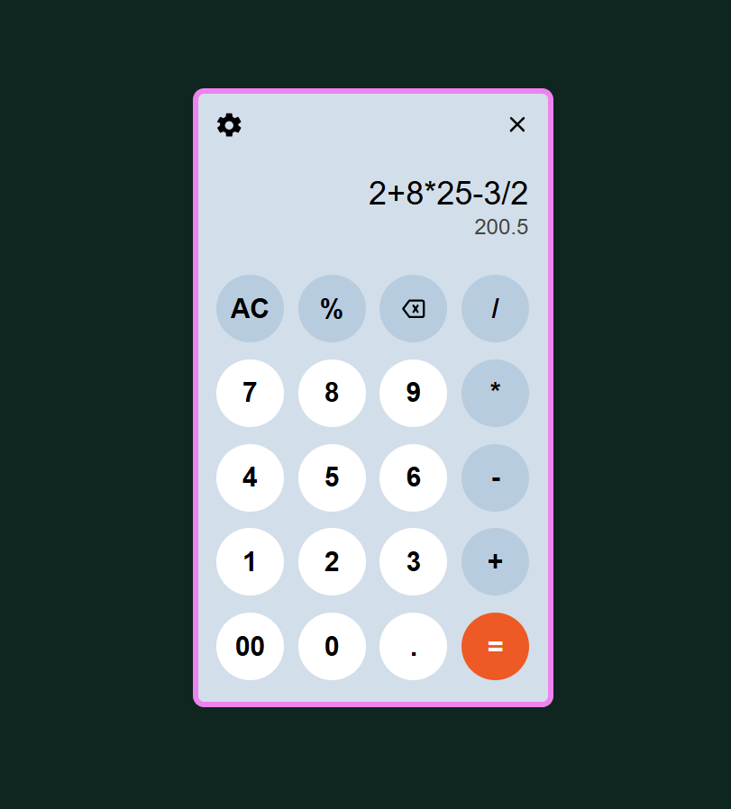
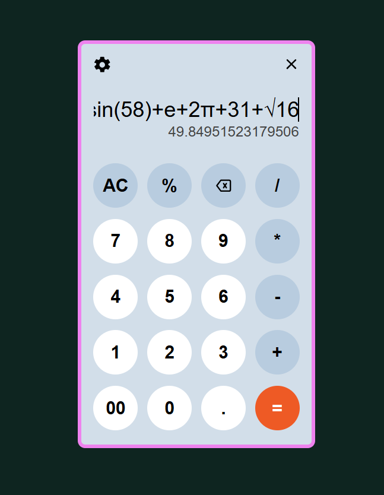
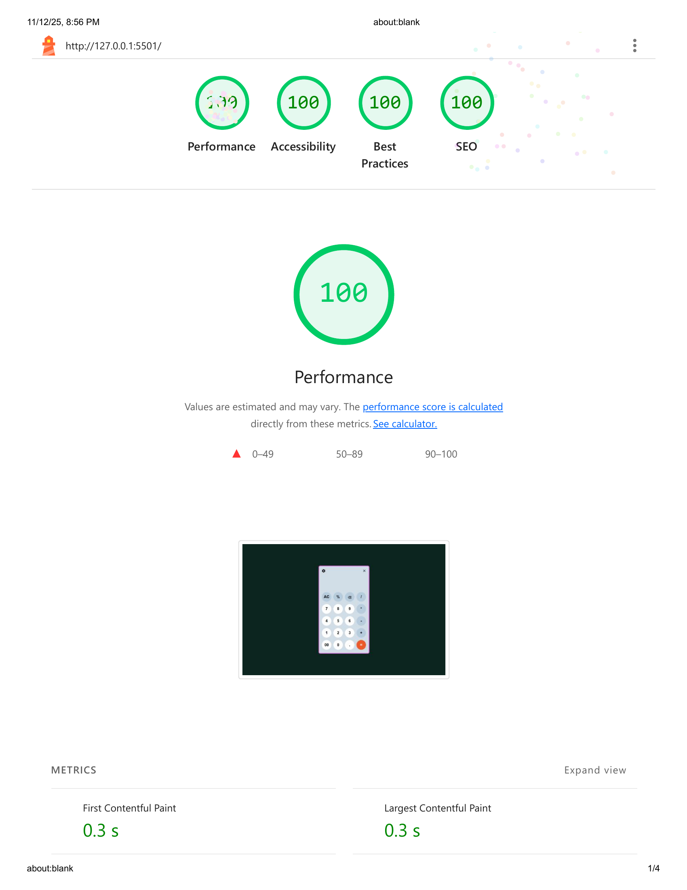

# 🧮 Advanced Scientific Calculator

A **fully functional scientific calculator** built with pure **HTML, CSS, and JavaScript** — supporting advanced mathematical operations, trigonometric functions, factorials, logarithms, power, and more.  
It works seamlessly on both desktop and mobile devices.

---

## 🌐 Live Demo 

👉 [View Demo on GitHub Pages](https://ahmednabil22224.github.io/Scientific-Calculator/)

---

## 🚀 Screenshots




---

## ✨ Features

- 🧠 **Basic Operations:** `+`, `-`, `×`, `÷`, `%`, powers, and square roots
- 🧮 **Scientific Functions:**
  - Trigonometric: `sin`, `cos`, `tan`, and their inverses
  - Logarithmic: `log`, `ln`, and `exp`
  - Factorial (`!`)
  - Power and roots (`x²`, `√x`, `10^x`)
- 🌡️ **Mode Conversion:** switch between **Degrees ↔ Radians**
- ⌨️ **Keyboard Support:** all functions can be entered via keyboard
- 💡 **Smart Input Handling:** prevents invalid sequences and mismatched brackets
- 📱 **Responsive Design:** fully adaptive for mobile and desktop screens

---

## 🛠️ Technologies Used

- **HTML5**
- **CSS3**
- **JavaScript (ES6)**

---

## 📊 Lighthouse Report

| Category       | Score |
| -------------- | ----- |
| Performance    | 100%  |
| Accessibility  | 100%  |
| Best Practices | 100%  |
| SEO            | 100%  |



## 📁 Project Structure

```
📦 calculator-app
┣ 📂 css
┃ ┗ style.css
┣ 📂 js
┃ ┗ main.js
┣📂 images
┃ ┗ lighthouse-report.png
┃ ┗ screenshots.png
┣ 📜 index.html
┗ 📜 README.md
```

---

## ⚙️ How to Run

1. Clone the repository:
   ```bash
   git clone https://github.com/ahmednabil22224/Scientific-Calculator.git
   ```

2.Open index.html directly in your browser.

# 💡 No build tools needed — pure vanilla JS.

# Scientific-Calculator
